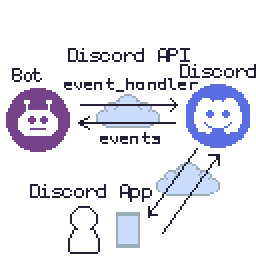

# Discord PokeDex Bot

Discord bot that retrieves pokemon info from the PokeAPI.

Tested on Ubuntu 22.04.

Quick start for Discord Pokedex Bot.

Requirements:
- [.NET Core](https://dotnet.microsoft.com/en-us/download) (try to use latest stable version)
- [Discord](https://discord.com/) Account

## Setup

Before you can run this bot you must have security credentials you first setup in your Discord account. [see](https://discordnet.dev/guides/getting_started/first-bot.html)

Make a `secure` folder. There's a `secureExample` for example. Or change `1secureExample` -> `secure`.
The app will read this folder for security credentials.
```
bot_token.txt <-- enter your bot token
guildID.txt <-- enter your guild ID
```

Get required libraries:
```sh
dotnet add package discord.net
```

Usage:
```sh
# build the project
dotnet build
# run the project
dotnet run
# watch files for changes and update
dotnet watch
```

## discord.NET Guide
[see](https://discordnet.dev/)


## Programming Guide

Event-Based Programming with discord.NET, an asynchronous, multi-platform .NET Library used to interface with the [Discord API](https://discord.com/).


Simplified architecture:


Example overview:
- User sends slash command to Bot.
- Discord sends events to Bot.
- Bot raises events based on the event type it received
- Bot calls event-handler(function) it mapped to specific event.
- All of this happens really fast over the internet.

e.g.
```
MessageReceived -> handle event: message received
UserIsTyping -> handle event: user typing 
SlashCommandExecuted -> handle event: slash command executed
```


This library uses asynchronous event-based programming to interface with the Discord API so its good to be clear on the terms:

[events](https://en.wikipedia.org/wiki/Event_(computing)) - actions or occurence that the software can recognize and may be able to respond to by [handling](https://en.wikipedia.org/wiki/Event_handler)(the event)

(`publishers/event_raisers`) (`raise/emit/output`) `events` that (`subscribers/listeners`) can (`subscribe/listen`) to and can choose to handle/resolve them how they wish (event_handling)

subscribers listen for (subscribe to) events that publishers raise

Example

In C# Events are a special kind of multicast [delegate](https://learn.microsoft.com/en-us/dotnet/csharp/programming-guide/delegates/) 
- that can only be invoked from within the class.

A delegate is a type that represents **references to methods**.
- delegates are used to pass `methods` as `arguments` to other `methods`
- in C# delegates are fully object-oriented, delegates encapsulate both and object instance and a method

Therefore `events` are types that represent **reference to methods** . This makes sense. When an event is raised it can be mapped to a reference to a method, which acts has the `event_handler` when `called/invoked`.

C# publish an event (publisher class)
```cs

// this class holds custom event args (CEA)
class CEA : EventArgs {
    // it just stores a message
    string Message {get;set;}
    CEA(string message){
        Message = message;
    }
}

class Publisher {
    public
    event EventHandler<CEA> RaiseEvent;

    // Event invokation
    void onRaiseEvent(CEA args){
        EventHandler<CEA> raiseEvent = RaiseEvent;

    }
}
```

C# subscribe to event (subscriber class)
```cs
class Subscriber {
    // constructor(Publisher pub)
        pub.RaiseEvent += HandleEvent
    //
    void HandleEvent(object sender, EventArgs arg){
        // handle event
    }
}
```

Usage
```cs
main(){
    var pub = new Publisher();
    var sub = new Subscriber(pub);
}

```